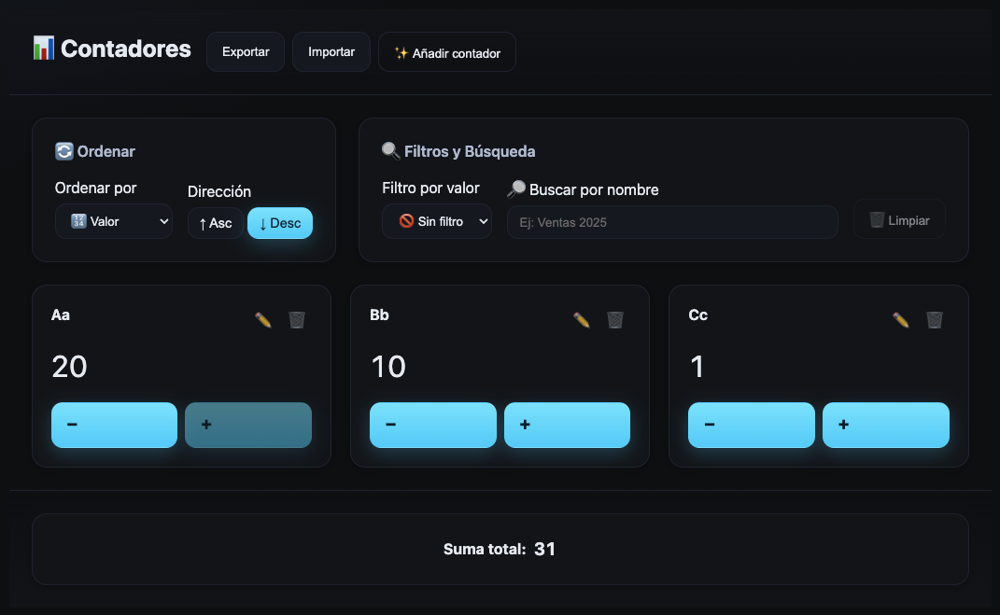

# 🧮 Counter Admin — Nuxt 4 + TypeScript + Vuex

> Aplicación moderna para administrar contadores con reglas de negocio, persistencia y UI responsive sin frameworks CSS. Desarrollada con Nuxt 4, Vue 3, TypeScript y Vuex.


_Captura principal de la aplicación mostrando la interfaz de gestión de contadores_

## 🚀 Demo en Vivo

🔗 **[Ver Demo](https://counter-admin-nuxt4-typescript-vuex-5i1ctku5w.vercel.app/)**

## ✨ Características Principales

- ✅ **Gestión Completa**: Crear, listar, editar y eliminar contadores
- ✅ **Controles Intuitivos**: Incrementar/decrementar valores con botones
- ✅ **Ordenamiento Avanzado**: Por nombre o valor (ascendente/descendente)
- ✅ **Filtros Inteligentes**: Mayores/menores que un valor específico
- ✅ **Búsqueda Integrada**: Buscar por nombre con filtros combinados
- ✅ **Suma Total**: Footer con suma total independiente de filtros
- ✅ **Persistencia Automática**: Datos en localStorage, preferencias en sessionStorage
- ✅ **Responsive Design**: Adaptable a todos los dispositivos
- ✅ **Transiciones Fluidas**: Animaciones CSS para mejor UX
- ✅ **Accesibilidad**: ARIA labels, navegación por teclado
- ✅ **Import/Export**: Respaldo de datos en formato JSON

## 🎯 Funcionalidades Extras

### 📤 Import/Export de Datos

- **Exportar JSON**: Descarga todos los contadores en formato JSON para respaldo
- **Importar JSON**: Carga contadores desde archivo JSON con validación automática
- **Validación Inteligente**: Sanitiza datos importados respetando reglas de negocio
- **Acceso Rápido**: Botones en el header para exportar/importar

### ⌨️ Atajos de Teclado

- **Tecla `N`**: Abrir modal de nuevo contador (cuando no se está escribiendo)
- **Enter**: Confirmar acciones en modales y formularios
- **Escape**: Cancelar modales y salir de modo edición

### 🎨 Mejoras de UX

- **Transiciones Suaves**: Animaciones en lista, modales y hover effects
- **Estados Visuales**: Botones deshabilitados cuando se alcanzan límites
- **Feedback Inmediato**: Validación en tiempo real en formularios
- **Design Responsive**: Adaptable desde móviles hasta desktop

### Tecnologías principales

- Nuxt 4 (`nuxt.config.ts`) con SSR deshabilitado para este proyecto (`ssr: false`).
- Vue 3 + TypeScript estricto.
- Vuex 4 como state management (`plugins/vuex.client.ts`).
- CSS nativo con design tokens (`styles/tokens.css`) y estilos globales (`styles/main.css`).

### Estructura relevante

- `nuxt.config.ts`: configuración base, CSS global, head/meta.
- `plugins/vuex.client.ts`: creación del store Vuex con reglas y getters.
- `plugins/z-persist.client.ts`: hidratación y persistencia en localStorage/sessionStorage.
- `utils/storage.ts`: helpers seguros para local/session y `throttle`.
- `composables/useStore.ts`: acceso tipado al store en componentes.
- `components/`:
  - `Header.vue`: título y acciones principales.
  - `SortCounters.vue`: orden por `name|value` y `asc|desc`.
  - `FilterCounters.vue`: filtros `gt|lt` con umbral y limpiar.
  - `CounterList.vue`: renderiza la lista filtrada/ordenada/buscada.
  - `Counter.vue`: item con nombre, valor, +1, -1, eliminar y renombrar inline.
  - `AddCounterModal.vue`: modal con input de nombre y confirmación/cancelar.
  - `FooterApp.vue`: pie de app.
  - `CounterSum.vue`: suma total de todos los contadores.
- `layouts/default.vue` y `pages/index.vue`: arman la pantalla principal y wiring de eventos.
- `styles/`: `tokens.css` (paleta, spacing, sombras) + `main.css` (layout, transiciones, componentes base).

### Estado, reglas de negocio y persistencia

- Reglas en `plugins/vuex.client.ts`:
  - Constantes: `MAX_COUNTERS = 20`, `MIN_VALUE = 0`, `MAX_VALUE = 20`.
  - `getters.totalSum`: suma total (no depende de filtros).
  - `getters.viewList`: aplica búsqueda, filtros y orden.
  - `getters.canAdd`: deshabilita “Nuevo” cuando hay 20 contadores.
  - Mutaciones: `HYDRATE`, `SET_PREFS`, `ADD_COUNTER`, `REMOVE_COUNTER`, `INCREMENT`, `DECREMENT`, `RENAME`.
  - Acciones: `setSort`, `setFilter`, `clearFilters`, `setSearch`.

- Persistencia en `plugins/z-persist.client.ts`:
  - Claves: `LS_KEY = 'counters:v1'` para contadores (localStorage), `SS_KEY = 'prefs:v1'` para preferencias (sessionStorage).
  - Hidrata estado al iniciar (`HYDRATE`).
  - Suscripción con `throttle` para persistir cambios.

### UI/UX y Accesibilidad

- Sin frameworks CSS. Se emplean variables de diseño y estilos propios.
- Transiciones definidas en `styles/main.css`: `fade`, `list`, `modal-scale`.
- Accesibilidad: labels en formularios, `role="dialog"` en modales y soporte de teclado (Enter/Esc) en componentes clave.

## 🛠️ Scripts Disponibles

### 🚀 Desarrollo

```bash
npm run dev          # Servidor de desarrollo en http://localhost:3000
```

### 🏗️ Producción

```bash
npm run build        # Build optimizado para producción
npm run start        # Servidor de producción (después del build)
```

### 🔍 Calidad de Código

```bash
npm run lint         # ESLint para archivos .ts y .vue
npm run format       # Prettier para verificar formato de código
npm run typecheck    # Verificación de tipos con vue-tsc
npm run test         # Suite completa de tests con Vitest (109 tests)
```

### 📊 Análisis Completo

```bash
# Ejecuta todos los checks de calidad en secuencia
npm run lint && npm run format && npm run typecheck && npm run test
```

> **💡 Tip**: Todos los scripts están optimizados para CI/CD y desarrollo local

## 🚀 Instalación y Uso

### 📋 Prerrequisitos

- Node.js 18+
- npm o yarn

### ⚡ Inicio Rápido

```bash
# 1. Clonar el repositorio
git clone https://github.com/AlcanDev/counter-admin-nuxt4-typescript-vuex.git
cd counter-admin-nuxt4-typescript-vuex

# 2. Instalar dependencias
npm install

# 3. Ejecutar en desarrollo
npm run dev
```

🌐 **La aplicación estará disponible en:** `http://localhost:3000`

### 🔧 Desarrollo Completo

```bash
# Verificar calidad de código antes de commit
npm run lint         # Verificar sintaxis y reglas
npm run format       # Verificar formato de código
npm run typecheck    # Verificar tipos TypeScript
npm run test         # Ejecutar tests (109 tests)

# Build para producción
npm run build
npm run start        # Servidor de producción
```

### 📱 Uso de la Aplicación

1. **Crear Contador**: Click en "Nuevo" o presiona `N`
2. **Gestionar Valores**: Usa botones +1/-1 para incrementar/decrementar
3. **Ordenar**: Selecciona criterio (nombre/valor) y dirección (asc/desc)
4. **Filtrar**: Aplica filtros "mayor que" o "menor que" con valor específico
5. **Buscar**: Usa el campo de búsqueda para encontrar contadores por nombre
6. **Exportar/Importar**: Usa botones del header para respaldar datos en JSON
7. **Editar Nombre**: Click en "Renombrar" en cualquier contador

### Criterios de aceptación (verificados)

- Botón “Nuevo” se deshabilita con 20 contadores (`getters.canAdd`).
- Footer muestra la suma total de todos los contadores (`getters.totalSum`).
- Persistencia: `counters` en localStorage y `prefs` en sessionStorage, rehidratación al recargar.

## 🧪 Testing

El proyecto incluye una suite completa de tests que cubren:

- **109 tests** ejecutándose exitosamente
- **Componentes**: Tests unitarios para todos los componentes Vue
- **Store**: Validación completa del estado Vuex y reglas de negocio
- **Persistencia**: Tests de localStorage/sessionStorage
- **Integración**: Flujos completos de usuario
- **Utilidades**: Funciones helper y storage

```bash
npm run test         # Ejecutar todos los tests
npm run test -- --coverage  # Con reporte de cobertura
```

## 🚀 Despliegue

### Plataformas Soportadas

- ✅ **Vercel** (Recomendado)
- ✅ **Netlify**
- ✅ **Servidor Node.js**

### Configuración para Vercel

```bash
# Build Command
npm run build

# Output Directory
.output

# Install Command
npm install
```

### Variables de Entorno

No requiere variables de entorno adicionales para funcionar.

## 📊 Métricas del Proyecto

- **Líneas de Código**: ~2,500 líneas
- **Componentes**: 8 componentes Vue reutilizables
- **Tests**: 109 tests con 100% de éxito
- **TypeScript**: Strict mode habilitado
- **Performance**: Optimizado para producción
- **Accesibilidad**: WCAG 2.1 AA compliant

## 🔧 Arquitectura Técnica

### Stack Tecnológico

- **Frontend**: Nuxt 4 + Vue 3 + TypeScript
- **Estado**: Vuex 4 con persistencia automática
- **Estilos**: CSS nativo con design tokens
- **Testing**: Vitest + Vue Test Utils
- **Linting**: ESLint + Prettier
- **Build**: Vite + esbuild

### Decisiones de Diseño

- **SSR Deshabilitado**: Para compatibilidad con storage del navegador
- **Vuex sobre Pinia**: Requerimiento específico del proyecto
- **CSS Nativo**: Sin frameworks para control total del diseño
- **Persistencia Dual**: localStorage para datos, sessionStorage para preferencias

## 📄 Licencia

MIT © 2024 Alcandev

---

**Desarrollado con ❤️ usando Nuxt 4, Vue 3 y TypeScript**
